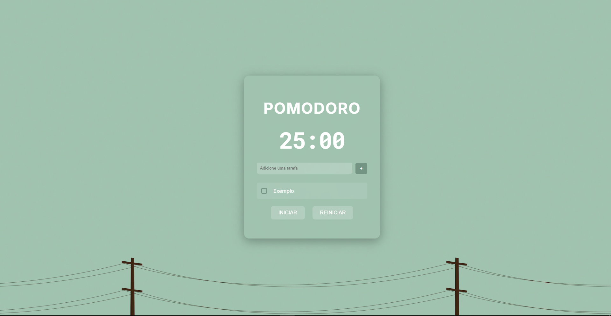

🚀 Visão Geral
Um Pomodoro Timer interativo com gerenciador de tarefas integrado, desenvolvido em React. Combina a técnica Pomodoro clássica (25min de foco + 5min de pausa) com funcionalidades modernas como:
✅ Controle de tarefas
✅ Notificações visuais/sonoras
✅ Acompanhamento de ciclos
✅ Favicon e título dinâmicos

🛠️ Funcionalidades
⏱️ Timer Inteligente
25 minutos de foco → 5 minutos de pausa

Pausa longa (15min) após 4 ciclos completos

Título da página e favicon atualizados em tempo real

📌 Gerenciador de Tarefas
Adicione, marque como concluída ou remova tarefas

Contador de sessões por tarefa (0/4 a 4/4)

Auto-deseleção ao marcar checkbox

🎨 Features Extras
Notificações do navegador ao terminar o tempo

Sons personalizados para início/fim de sessão

Persistência das tarefas no localStorage

🖥️ Tecnologias
React (Componentes funcionais + Hooks)

CSS (Estilos modulares e responsivos)

Web APIs (Notification, Audio, localStorage)

